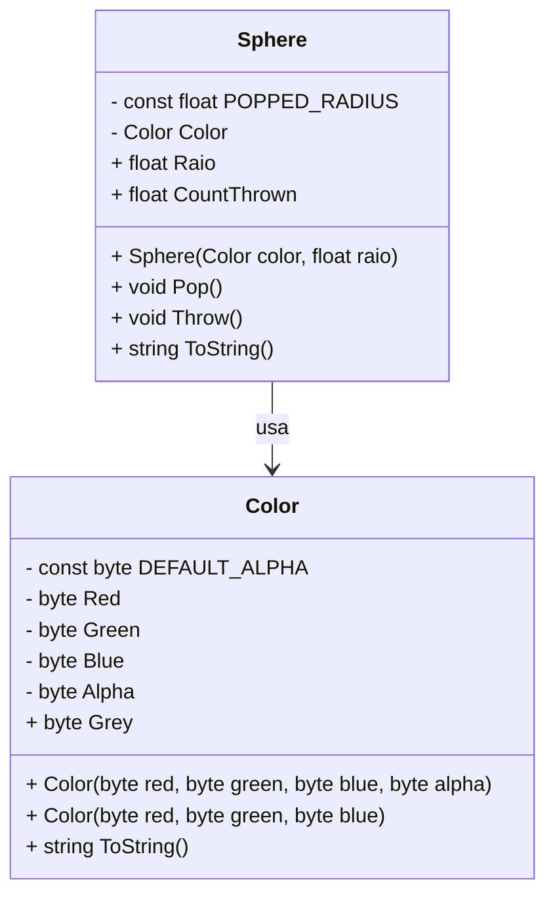

```mermaid
classDiagram

    class Color {
        - const byte DEFAULT_ALPHA
        - byte Red
        - byte Green
        - byte Blue
        - byte Alpha
        + Color(byte red, byte green, byte blue, byte alpha)
        + Color(byte red, byte green, byte blue)
        + byte Grey
        + string ToString()
    }

    class Sphere {
        - const float POPPED_RADIUS
        - Color Color
        + float Raio
        + float CountThrown
        + Sphere(Color color, float raio)
        + void Pop()
        + void Throw()
        + string ToString()
    }

    Sphere --> Color : usa
```